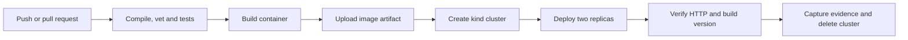

# Rollout Planner — Session 16

Vimal Kumar Yadav · 24BCS10273

A small Go HTTP API estimates the batches needed to roll out a set of replicas. GitHub Actions compiles and tests it, builds a non-root container, transfers that image as an artifact, then deploys it to a temporary kind cluster and checks the API through a Kubernetes Service.

For seven replicas deployed in batches of three, taking twenty seconds per batch, the API returns three batches, one replica in the final batch and an estimated sixty seconds. This is a planning calculation; it does not change any infrastructure.

## API and local use

| Route | Behavior |
| --- | --- |
| `GET /` | Application identity and build commit/version |
| `GET /healthz` | Health check |
| `POST /api/plan` | Validate inputs and calculate a rollout plan |

```bash
go test -race -v ./...
go run ./cmd/server
# In another terminal:
curl -s http://localhost:8080/healthz
curl -s http://localhost:8080/api/plan -H 'Content-Type: application/json' \
  -d '{"replicas":7,"batch_size":3,"seconds_per_batch":20}'
```

Inputs are bounded, malformed/unknown JSON fields are rejected, and the HTTP server limits body size and request time. Tests cover partial and exact batches, maximum values, invalid numbers, malformed/oversized requests, version metadata and wrong routes/methods. The application has no third-party Go dependencies.

```bash
docker build --build-arg VERSION=local -t rollout-planner:local .
docker run --rm --read-only --cap-drop ALL -p 127.0.0.1:8080:8080 rollout-planner:local
```

The Dockerfile compiles a static executable in a Go build stage, then copies only that executable into `scratch`. It runs as UID/GID 65532.

## Pipeline



| Concept | How this project demonstrates it |
| --- | --- |
| CI | Each code push or PR is compiled, vetted and tested automatically. |
| CD | A passing image is deployed and verified in a disposable Kubernetes environment. This is an ephemeral deployment demonstration, not persistent hosting. |
| Workflow | [pipeline.yml](.github/workflows/pipeline.yml) defines triggers, permissions and the job dependency graph. |
| Jobs | `test`, `image` and `deploy` run on separate GitHub-hosted Ubuntu 24.04 runners. `needs` prevents later jobs from running after failure. |
| Steps | Checkout, Go setup, commands and artifact transfers execute in order within each job. |
| Runners | GitHub supplies fresh machines containing Docker; pinned kind and kubectl binaries are installed with SHA256 verification. |
| Secrets | GitHub supplies the short-lived `GITHUB_TOKEN` for checkout and artifact access. No AWS keys or persistent cluster credentials are needed. Its permissions are explicitly limited. |
| Artifacts | Test/coverage results, the container image, image metadata and Kubernetes/HTTP/cleanup evidence are retained for fourteen days. |
| Build | Go compilation catches build errors; Docker produces the exact executable image later loaded into kind. |
| Test | Race-enabled HTTP tests gate the build; deployment smoke checks verify the running service and embedded commit ID. |

Actions are pinned to commit SHAs. The temporary cluster uses an official kind node image pinned by digest. Deployment uses two replicas, resource limits, startup/readiness/liveness probes and a read-only, non-root container. The cleanup trap records diagnostics and deletes the cluster even after a failed smoke test; an `always()` workflow step repeats deletion as a fallback.

To repeat deployment locally on Linux x86_64 with Docker:

```bash
python3 scripts/install-tools.py kind kubectl
EXPECTED_VERSION=local bash scripts/deploy.sh rollout-planner:local
```

The script uses its own kubeconfig under ignored `.tools/` and creates a specifically named cluster. It does not use an existing cluster. The fixed local forwarding port is 18080; override `LOCAL_PORT` if necessary. The created cluster is deleted when the script exits.

## Execution evidence

Workflow run links, the deliberate failing-test demonstration and screenshots will be recorded in `evidence/README.md` after execution. Reports under `reports/` are local/runtime outputs and are not committed automatically.

This project follows the [session 16 homework](https://docs.google.com/document/d/1cjXFYf2Thm8cBEN-0C48B-v02cj3jGLd47lcO18prHE/edit) and the instructor's [pipeline exercise](https://github.com/Nency-Ravaliya/devops-heros/tree/main/session-16-github-actions/session-16-github-actions/10-final-cicd-pipeline), extended with a real temporary Kubernetes deployment.
