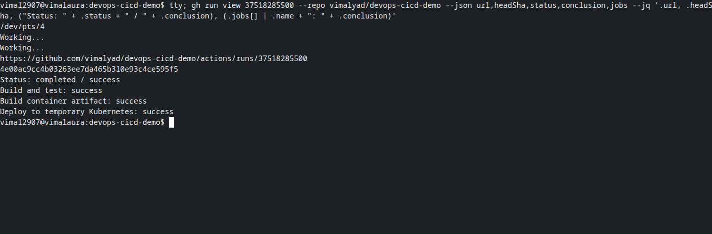
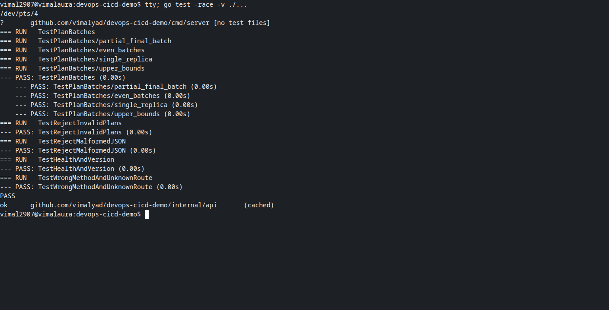
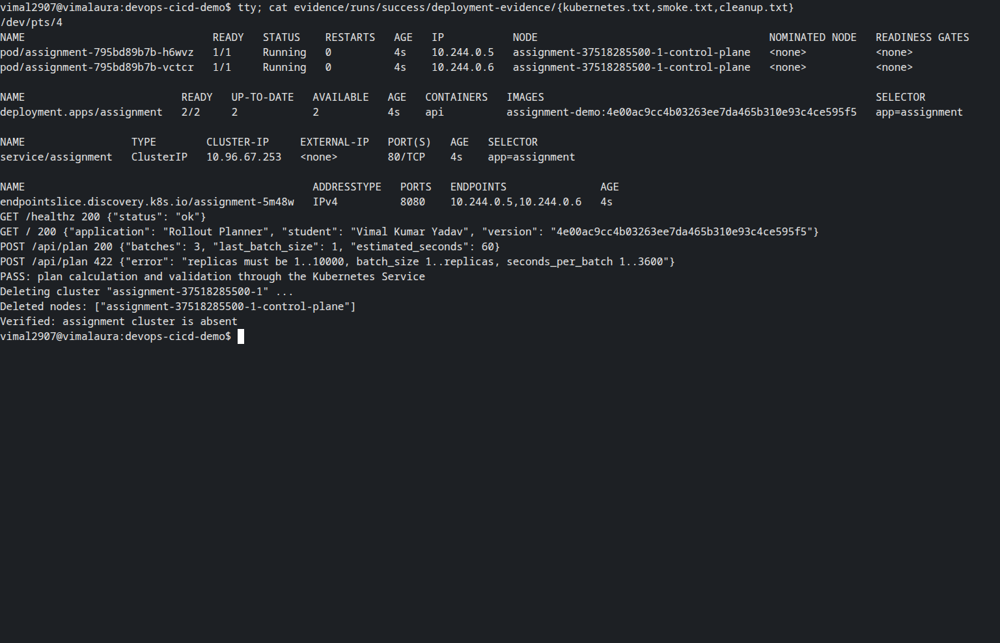
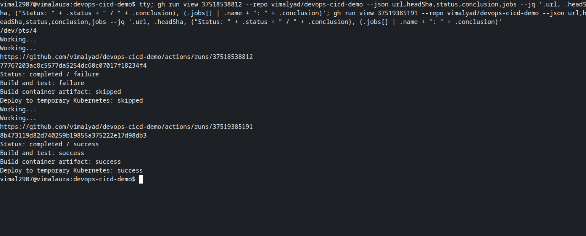
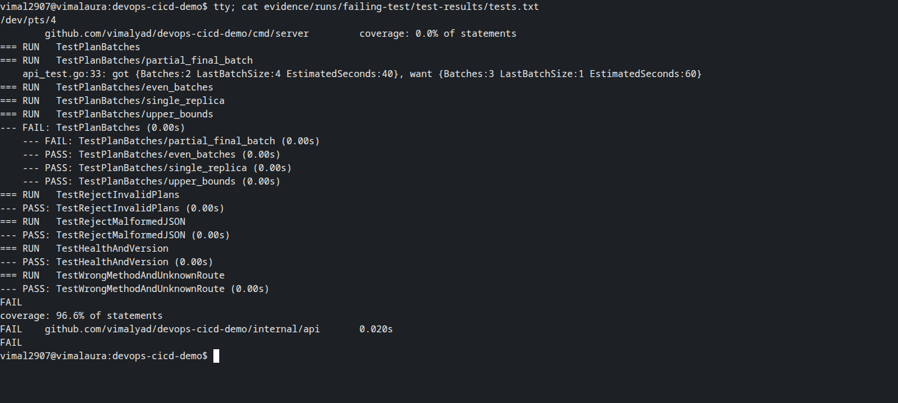

# Pipeline execution evidence

Vimal Kumar Yadav · 24BCS10273

These runs executed on GitHub-hosted runners on 6 October 2026 UTC (7 October in India). The commit IDs below identify the code tested; later documentation and screenshot commits do not change that recorded provenance.

| Exercise | GitHub run | Tested commit | Result | Preserved output |
| --- | --- | --- | --- | --- |
| Successful implementation | [37518285500](https://github.com/vimalyad/devops-cicd-demo/actions/runs/37518285500) | `4e00ac9cc4b0` | success | [Metadata](runs/success/run.json), [full log](runs/success/actions.log) |
| Intentional failure | [37518538812](https://github.com/vimalyad/devops-cicd-demo/actions/runs/37518538812) | `77767203ac8c` | failure | [Metadata](runs/failing-test/run.json), [full log](runs/failing-test/actions.log) |
| Exercise corrected | [37519385191](https://github.com/vimalyad/devops-cicd-demo/actions/runs/37519385191) | `8b473119d82d` | success | [Metadata](runs/recovered/run.json), [full log](runs/recovered/actions.log) |

The successful run compiled and vetted the application, passed race-enabled tests, built the non-root image and deployed two ready replicas in kind. The HTTP response reported the same commit as the run. Seven replicas in batches of three produced **3 batches, a final batch of 1 and 60 seconds**. Invalid input returned HTTP 422.

On `exercise/failing-test`, integer division replaced the ceiling calculation. The partial-batch test observed **2 batches, a final batch of 4 and 40 seconds** and failed. The image and deployment jobs were skipped. A separate correction commit restored the formula and the complete pipeline passed. The intentional defect is absent from the PR branch and from the current exercise branch.

The API package's statement coverage was 96.6%; this is not whole-program coverage. The deployment smoke checks also exercised the compiled server through Kubernetes.

- [Unit test results](runs/success/test-results/tests.txt)
- [Failed partial-batch test](runs/failing-test/test-results/tests.txt)
- [Ready workloads and Service](runs/success/deployment-evidence/kubernetes.txt)
- [HTTP checks and build version](runs/success/deployment-evidence/smoke.txt)
- [Cluster deletion](runs/success/deployment-evidence/cleanup.txt)
- [Deletion after the corrected exercise](runs/recovered/deployment-evidence/cleanup.txt)

Both successful runs deleted their temporary clusters and verified they were absent. The intentional failures never reached deployment. No AWS resources were used. Artifact text reports are preserved here because GitHub's uploaded artifacts have a fourteen-day retention period.

## Terminal screenshots

Every screenshot contains only a real spawned Bash pseudo-terminal, captured through Playwright/CDP. The visible `tty` command identifies the PTY. GitHub run queries and local tests execute directly; `cat` and `jq` inspect the unchanged downloaded reports. Saved reports are evidence of their original runs, not a claim that those deployments were rerun during capture.

